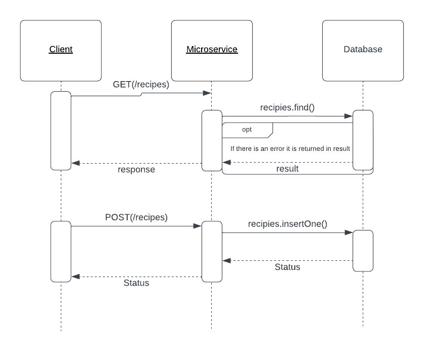

# CS361-Microservice

You can communicate with the microservice through GET and POST requests. client.js provides examples of what the requests look like client side.

- POST to add a recipe with the following JSON format:
            Name: 'Kebab',
            totalCalories: '1200',
            Ingredients: [{Name: "Tomato", Measurement: "200g", Calories: "200"}, {Name: "Rice", Measurement: "800g", Calories: "1000"}]

- GET to request data with the following URLs:
    - {URL}/recipies for all recipies
    - {URL}/recipies/name$name for recipies of a specific name
    - {URL}/recipies/calories$calories for recipies with a specific number of totalCalories

For the requests I used the axios module and here is a test call with that:
await axios.get(http://flip4.engr.oregonstate.edu:3374/recipes)

You will recieve data in a json encoded format as such:
{
    _id: new ObjectId('65dc2fe2f7b6cd170cd4ad74'),
    Name: 'Kebab',
    totalCalories: '1200',
    Ingredients: [ {Name: 'Tomato', Measurement: '200g', Calories: '200'}, {Name: 'Rice', Measurement: '800g', Calories: '1000'} ]
}

